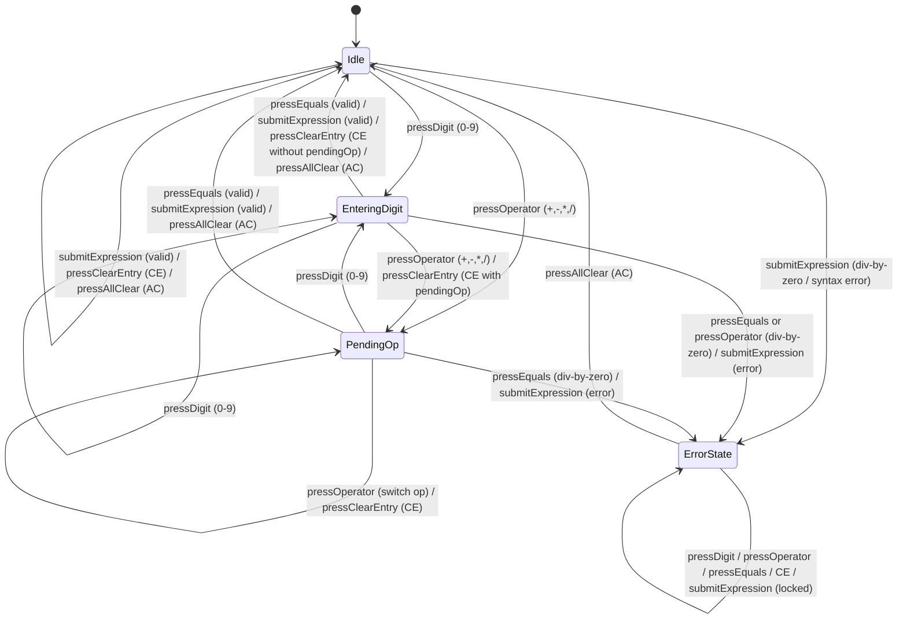

# Calculator State Chart

> Auto-generated from `CALCULATOR_STATE_TRANSITIONS` in [`src/core/calculator.ts`](../src/core/calculator.ts) via `npm run docs:state-chart`. Do not edit manually.

```mermaid
stateDiagram-v2
    [*] --> Idle
    Idle --> EnteringDigit: pressDigit (0-9)
    Idle --> PendingOp: pressOperator (+,-,*,/)
    Idle --> Idle: submitExpression (valid) / pressClearEntry (CE) / pressAllClear (AC)
    Idle --> ErrorState: submitExpression (div-by-zero / syntax error)
    EnteringDigit --> EnteringDigit: pressDigit (0-9)
    EnteringDigit --> PendingOp: pressOperator (+,-,*,/) / pressClearEntry (CE with pendingOp)
    EnteringDigit --> Idle: pressEquals (valid) / submitExpression (valid) / pressClearEntry (CE without pendingOp) / pressAllClear (AC)
    EnteringDigit --> ErrorState: pressEquals or pressOperator (div-by-zero) / submitExpression (error)
    PendingOp --> EnteringDigit: pressDigit (0-9)
    PendingOp --> PendingOp: pressOperator (switch op) / pressClearEntry (CE)
    PendingOp --> Idle: pressEquals (valid) / submitExpression (valid) / pressAllClear (AC)
    PendingOp --> ErrorState: pressEquals (div-by-zero) / submitExpression (error)
    ErrorState --> ErrorState: pressDigit / pressOperator / pressEquals / CE / submitExpression (locked)
    ErrorState --> Idle: pressAllClear (AC)
```
